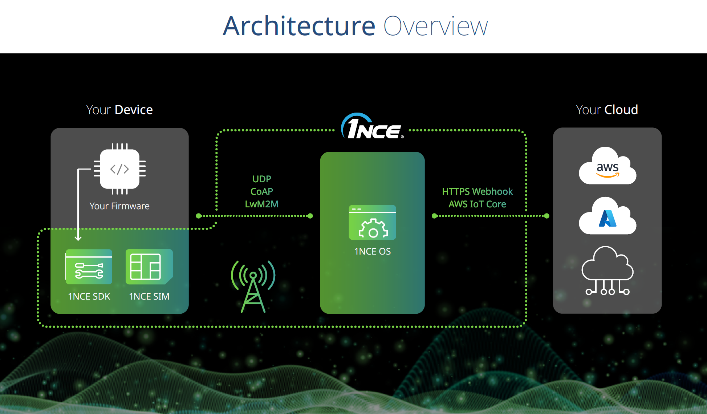
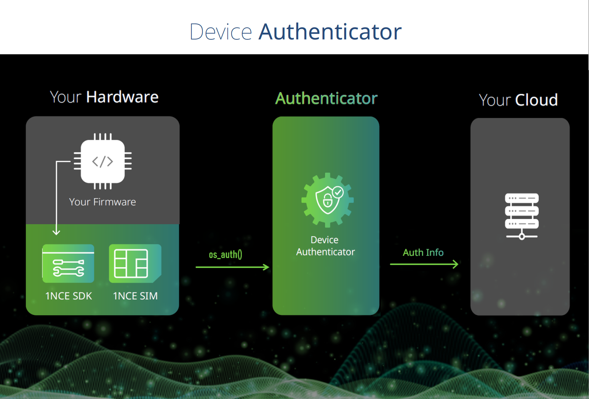
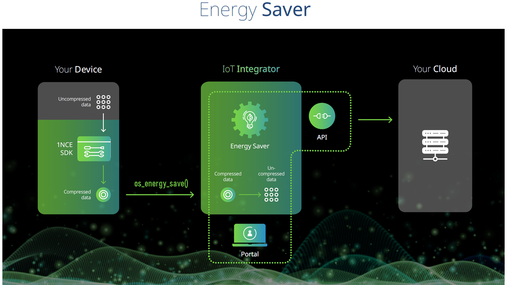

# 1NCE Arduino blueprint

## Overview

1NCE Arduino blueprint provides an  overview of various features of 1NCE OS including Device Authenticator, IoT Integrator and Energy Saver. In combination with 1NCE SDK.

## Supported Boards

The Blueprint is compatible with [Arduino Portenta H7](https://docs.arduino.cc/hardware/portenta-h7) and [Arduino Portenta H7 lite ](https://docs.arduino.cc/hardware/portenta-h7-lite) (running Mbed OS), attached to [Portenta Cat. M1/NB IoT GNSS Shield](https://docs.arduino.cc/hardware/portenta-cat-m1-nb-iot-gnss-shield).

## 1NCE IoT C SDK Integration

[1NCE IoT C SDK](https://github.com/1NCE-GmbH/1nce-iot-c-sdk) is a collection of C source files that can be used to connect and benefit from different services from 1NCE OS. The SDK is integrated with the blueprint through UDP & Log interfaces.

### Features
1NCE IoT C SDK contains the following services: 

 

### Device Authenticator (CoAP)
The 1NCE IoT c SDK also provides authentication for IoT devices communicating through DTLS. In this case, the device receives a DTLS Identity and a Pre-Shared Key (PSK) that can be used to establish a secure connection to the CoAP endpoint of 1NCE Data Broker.

 

More details about device authentification are available at [1NCE Developer Hub (Device Authenticator)](https://help.1nce.com/dev-hub/docs/1nce-os-device-authenticator). 

### Energy Saver (Binary conversion language)
The Energy Saver aims to minimize the payload size sent from the device to a simple byte array that can be converted to JSON Format. The resulting message is then sent using MQTT via the Data broker. Translating the byte array is done using Binary Conversion language which splits the array into a sequence of values defined in a translation template. 

 

 Check  [1NCE Developer Hub (Energy Saver)](https://help.1nce.com/dev-hub/docs/1nce-os-energy-saver) for further explantion of the translation template creation.

## Available Demos
- [UDP](examples/nce_udp_demo/README.md)

- [CoAP](examples/nce_coap_demo/README.md)

- [LwM2M](examples/nce_lwm2m_demo/README.md)
